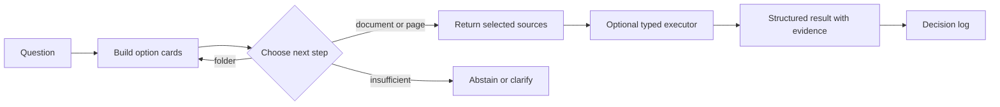

# JevRAG

**Retrieval as a sequence of small, inspectable decisions.**

[](https://github.com/cloudbtl/JevRAG/actions/workflows/ci.yml)
[](LICENSE)
[](pyproject.toml)

JevRAG navigates large document collections without placing the whole collection in a model context or reducing every query to nearest-neighbor search. At each hop, it gives a decision model a small set of well-described options: folders, documents, pages, actions, or a stop condition.

If each hop offers 20 branches, a six-hop tree has an address space of 64 million leaves while showing the model only one small option set at a time. That is a branching calculation, not a quality or latency claim. The tree only works when each option says what lies beneath it, so JevRAG treats descriptors and provenance as part of retrieval itself.



JevRAG is designed for [TypeSafe AI's Jev](https://docs.typesafe.ai/), a typed decision model. A deterministic heuristic keeps the project runnable without a Jev API key.

## Quick start: search a local folder

```bash
git clone https://github.com/cloudbtl/JevRAG.git
cd JevRAG
python -m venv .venv
source .venv/bin/activate
pip install -e .
```

Walk to one likely document using names and file-system metadata:

```bash
jevrag --local ~/Documents walk "Which folder contains the March 2026 rent roll?"
```

The result is JSON with a status, chosen path, target card, and per-hop ranking:

```json
{
  "status": "document",
  "path": ["Finance", "Rent Rolls", "March_2026_Rent_Roll"],
  "target": {
    "kind": "document",
    "label": "March_2026_Rent_Roll",
    "id": "doc:Finance/Rent Rolls/March_2026_Rent_Roll.xlsx"
  }
}
```

Gather every relevant document across multiple branches:

```bash
jevrag --local ~/Documents gather "All files named for Project Aurora"
```

Local mode reads names, extensions, sizes, modified times, subtree counts, Office titles, sheet names, slide counts, PDF page counts, and the first line of small text files. It does not send document bodies to the decision model.

Add Jev when you want model-based choices:

```bash
export TYPESAFE_API_KEY=...
jevrag --local ~/Documents gather "All evidence for the 2026 renewal decision"
```

## Design principles

1. **Describe before deciding.** Retrieval quality starts with option cards that state contents, conditions, coverage, and provenance.
2. **The model chooses; code executes.** Jev selects sources and actions. Deterministic executors perform lookup, filtering, counting, and comparison.
3. **Abstention is a result.** Weak options produce `insufficient_options` or a clarification request instead of a forced winner.
4. **Trees are views, not truth.** Folder, facet, memory, and generated trees can coexist over the same documents.
5. **Domain meaning is injected.** Departments, terminology, memory layers, and filing rules come from deployment configuration.
6. **Every decision is reviewable.** Logs retain the options shown, scores returned, paths taken, actions executed, and evidence used.
7. **Human moves win.** A person can move and pin a document; automated filing must preserve that override.

## Four operations, one option contract

| Command | Question it answers | Result |
| --- | --- | --- |
| `walk` | “Which single branch or document should I open?” | One path and target |
| `gather` | “Which documents across the tree may all matter?” | Relevant, maybe, and pruned sets |
| `file` | “Where should this incoming document live?” | Placement or undecided |
| `watch` | “Can filing continue as documents arrive?” | Repeated, logged placement passes |

All four consume the same compact cards. The option source may be a local directory or a CloudBTL tree.

`walk` and `gather` select sources; they do not write a prose answer. `ask` can execute typed operations over structured descriptors and returns a structured result with evidence. Answer wording belongs to the calling application.

## What the model sees

The routing model does not receive the full document body when choosing a branch. After an enricher has added a summary and typed fields, a document card can look like this:

```json
{
  "label": "Q3 staffing quote",
  "doc_type": "quote",
  "summary": "Line items, quantities, unit prices, VAT status, and vendor",
  "contains": ["fields.quote"],
  "conditions": ["currency=KRW", "vatIncluded=false"],
  "coverage": ["pages=3", "hasText=true"]
}
```

Raw text, source URLs, credentials, and unbounded metadata are masked from routing state. After a document is chosen, executors may read the structured descriptors and page text required for the selected action and retain page-level evidence.

See [Option Card](docs/OPTION-CARD.md) for the card schema and [Decision Loop](docs/DECISION-LOOP.md) for questions, rubrics, and fallback behavior.

## Use with CloudBTL

[CloudBTL](https://cloudbtl.com) stores document bytes or source links, hashes, versions, logical trees, and producer-scoped descriptors. JevRAG consumes its option API:

```text
GET /api/options?tree=folders&at=<node-or-document>&limit=20
```

Configure a workspace:

```bash
export CLOUDBTL_API_BASE=https://acme.cloudbtl.com
export CLOUDBTL_TOKEN=cbtl_xxxxxxxx
export TYPESAFE_API_KEY=...            # optional

jevrag walk "Which rent roll contains the March tenant deposits?"
jevrag gather "Every document needed to reconcile Project Aurora"
```

At a node, options are child nodes followed by documents. At a document, options may become pages. Cards from deterministic extraction and external enrichers remain distinguishable by producer and version.

## Choosing which card fields to expose

Large descriptor sets can create noisy cards. `--fields auto` first presents available field families and coverage, then lets Jev select a profile for the retrieval run:

```bash
jevrag --local ~/Documents gather "Compare quote totals" --fields auto
jevrag walk "March rent roll" --fields docType,period,entities
```

Labels, document type, summary, and document counts remain visible as a fixed base. The chosen profile is recorded in the decision log.

## Filing documents

Filing walks the tree in reverse: the incoming document becomes the question and destination folders become options.

```bash
# Preview local moves first
jevrag --local ~/Documents --inbox ~/Downloads file --dry-run

# Apply and record moves
jevrag --local ~/Documents --inbox ~/Downloads file \
  --log ~/Documents/.jevrag/file.jsonl
```

Local filing moves files on disk. Every move is appended to `.jevrag/ledger.jsonl` with its old and new path. There is no automatic rollback; use that record to restore a move manually. Placements recorded through the source with `by=human` are pinned so Jev will not move them again.

Repositories are searchable but are never filing destinations. Additional exclusions and folder descriptions live in `.jevrag/config.json`:

```json
{
  "domains": {
    "Work": "Contracts, proposals, reports, and financial records",
    "Personal": "Receipts, photos, and personal documents"
  },
  "no_filing": ["Archive*", "Scratch*"],
  "descriptions": {
    "Reference": "Material used for lookup, never project delivery"
  }
}
```

Cloud filing uses logical tree attachments rather than moving source files:

```bash
jevrag seed-trees --skeleton ./examples/company-skeleton.json
jevrag file --tree filed --limit 300 --log file.jsonl
```

The skeleton controls domain names, descriptions, topics, and optional inheritance. The engine supplies the mechanism without embedding an organization chart.

## Watch an inbox

```bash
# Local polling
jevrag --local ~/Documents --inbox ~/Downloads watch \
  --log ~/Documents/.jevrag/file.jsonl

# Install as a macOS LaunchAgent
jevrag --local ~/Documents --inbox ~/Downloads watch --install-launchd

# One cloud pass, suitable for cron
jevrag watch --tree filed --once
```

The watcher waits for files to stop changing, ignores browser and Office temporary names, groups dropped folders, and leaves undecided items in the queue for a later pass.

## Enrich cards with a local model

Deterministic cards are useful headers; a short content summary can make a tree much easier to navigate. `enrich-cards` reads extracted text from CloudBTL, asks a local Ollama model for structured output, and writes `card.doc` and `card.node` descriptors under producer `llm-cards`.

```bash
jevrag enrich-cards \
  --model qwen3.6:35b-a3b \
  --limit 600 \
  --max-minutes 360 \
  --log enrich.jsonl
```

One failed document does not stop the run. Node cards are refreshed when their underlying document counts change materially.

## Descriptor conventions

All descriptors are optional. JevRAG currently recognizes these families:

| Kind | Used for |
| --- | --- |
| `doc.meta` | file type, page count, text availability |
| `text.page` | post-selection lookup and evidence snippets |
| `class.doc` | document type, stage, event type, industry |
| `fields.quote` | items, quantities, unit prices, totals, VAT, vendor |
| `fields.contract` | parties, dates, amount, clauses |
| `fields.result` | visitors, sessions, revenue, KPIs |
| `fields.proposal` | brand, category, event type, budget, venue, programs |
| `faq.doc` | page-linked questions and answers |
| `context.*` | project, client, stage, outcome, or other external context |

Unknown descriptors remain available to other consumers; JevRAG does not need to own every enrichment schema.

## Decision logs and evaluation

Each run can append a JSONL record containing:

- the original question
- every option shown at each hop
- scores, confidence, and selected actions
- the resulting path or placement
- evidence and failure status

```bash
jevrag replay decisions.jsonl
```

The [evaluation harness](eval/README.md) measures candidate coverage, decision quality, and final evidence separately. Reference evidence must be assembled independently of the retriever; a ranking change alone is not treated as an accuracy gain.

## Status

JevRAG is a reference implementation at v0.2. Local and CloudBTL-backed walk, gather, filing, watch, card enrichment, field profiling, and decision logging run end to end. Structured field, FAQ, and entity-linking producers are external enrichers and remain deployment-specific.

## Development

```bash
pip install -e '.[dev]'
pytest -q
```

## Security

Option cards are a data boundary, not an access-control boundary. The source system must still enforce document and tenant permissions before returning candidates.

Please report vulnerabilities privately as described in [SECURITY.md](SECURITY.md).

## License

Apache License 2.0. See [LICENSE](LICENSE) and [NOTICE](NOTICE).
